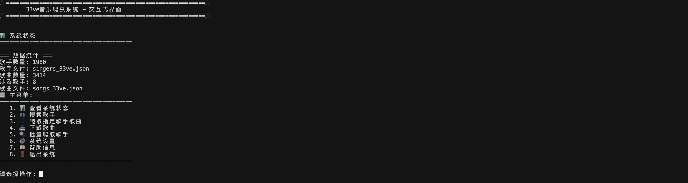
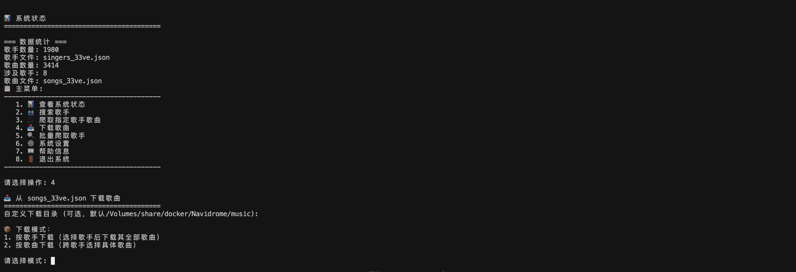
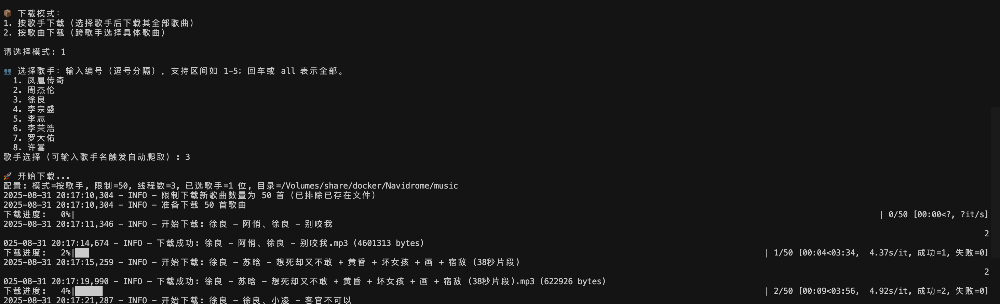

# 33ve音乐网站爬虫系统

一个功能完整的音乐网站爬虫系统，支持歌手信息爬取、歌曲信息获取和音乐文件下载。

## 🚀 功能特性

### 核心功能
- **歌手信息爬取**：获取网站所有歌手的基本信息和ID
- **歌曲信息爬取**：获取每个歌手的所有歌曲信息和下载链接
- **音乐文件下载**：批量下载歌曲文件到本地
- **数据去重**：智能去重，确保数据质量
- **并发处理**：支持多线程并发，提高爬取效率

### 高级功能
- **代理池支持**：避免IP被封，支持多种代理源
- **安全模式（配置驱动）**：保守的单线程+延时策略，降低被检测风险（由配置开启）
- **断点续传**：支持中断后继续爬取
- **进度显示**：实时显示爬取和下载进度
- **错误处理**：完善的重试机制和错误恢复

## 📁 文件结构

```
search_music/
├── README.md                 # 项目说明文档
├── requirements.txt          # Python依赖包
├── main_crawler.py          # 主控制脚本
├── crawl_singers.py         # 歌手信息爬虫
├── crawl_songs.py           # 歌曲信息爬虫
├── download_songs.py        # 歌曲下载器
├── proxy_pool.py            # 代理池管理器
├── config.py                # 配置读取（支持 config.json 覆盖）
├── config.json             # 自定义配置（可选）
├── manual_proxies.txt       # 手动代理配置文件
├── singers_33ve.json        # 歌手数据（1980个歌手）
├── songs_33ve.json          # 歌曲数据
├── working_proxies.json     # 可用代理列表
├── music_downloads/         # 下载的音乐文件目录
└── venv/                    # Python虚拟环境
```

## 🛠️ 安装和配置

### 1. 环境要求
- Python 3.8+
- 稳定的网络连接
- 足够的磁盘空间（用于存储音乐文件）

### 2. 安装依赖
```bash


# 安装依赖包
pip install -r requirements.txt
```

### 3. 依赖包说明
```txt
requests>=2.31.0          # HTTP请求库
aiohttp>=3.9.1            # 异步HTTP库
beautifulsoup4>=4.12.2    # HTML解析库
fake-useragent>=1.4.0     # 随机User-Agent
tqdm>=4.66.1              # 进度条显示
pandas>=2.1.4             # 数据处理
openpyxl>=3.1.2           # Excel文件支持
```

## 🎯 使用方法

### 主控制脚本 (推荐)

```bash
# 查看帮助
python main_crawler.py --help

# 完整流程（爬取歌手 -> 歌曲 -> 下载）
python main_crawler.py --mode full --limit-singers 10 --limit-songs 50

# 只爬取歌手信息
python main_crawler.py --mode singers

# 只爬取歌手信息（按名称关键词）
python main_crawler.py --mode singers --singer-name "周"

# 只爬取歌手信息（多个关键词，用分号分隔，任一命中）
python main_crawler.py --mode singers --singer-name "李宗盛;罗大佑"

# 只爬取歌曲信息
python main_crawler.py --mode songs --limit-singers 20 --max-workers 5

# 只爬取歌曲信息（按名称关键词；多个关键词用分号分隔）
python main_crawler.py --mode songs --limit-singers 50 --max-workers 5 --singer-name "李宗盛;罗大佑;周华健"

# 只下载歌曲文件
python main_crawler.py --mode download --limit-songs 100 --max-workers 3

# 交互式界面（推荐用于筛选与下载）
python interactive_crawler.py

```

### 交互式下载说明

- 爬取指定歌手：结果直接合并到 `songs_33ve.json`（按 `id` 去重并更新统计）。
- 下载歌曲：
  - 模式1：按歌手下载（选择一批歌手后下载其全部歌曲）。
  - 模式2：按歌曲下载（跨歌手选择具体歌曲）。
  - “限制N首”仅作用于“未下载过”的歌曲；已存在文件自动跳过。
  - 线程数与数量限制默认取自配置；下载目录可在交互时临时指定（留空走配置）。

提示：命令行模式下，`--mode songs` 的结果会合并写入现有的 `songs_33ve.json`（按 `id` 去重），不会覆盖已有歌手的数据。

### 示例操作序列

1) 按歌手下载（多选）

```bash
python interactive_crawler.py
# 步骤：
# 1. 进入主菜单选择 4（下载歌曲）
# 2. 选择模式：输入 1（按歌手下载）
# 3. 歌手选择：例如输入 1-3,5,8-10 表示选择编号 1~3、5、8~10 的歌手（回车/all 表示全部）
# 4. 下载目录：回车使用配置目录（或输入自定义目录）
# 5. 自动开始下载（数量与线程使用配置默认值，已存在文件会跳过）
```

2) 按歌曲下载（跨歌手）

```bash
python interactive_crawler.py
# 步骤：
# 1. 进入主菜单选择 4（下载歌曲）
# 2. 选择模式：输入 2（按歌曲下载）
# 3. 歌曲选择：例如输入 1-50 表示选择当前展示列表前 50 首（回车/all 表示全部）
# 4. 下载目录：回车使用配置目录（或输入自定义目录）
# 5. 自动开始下载（数量与线程使用配置默认值，已存在文件会跳过）
```

3) 爬取指定歌手并合并到 songs_33ve.json

```bash
python interactive_crawler.py
# 步骤：
# 1. 进入主菜单选择 3（爬取指定歌手歌曲）
# 2. 输入歌手关键词，选择匹配的歌手
# 3. 爬取完成后，歌曲会自动合并到 songs_33ve.json（按 id 去重与统计）
# 4. 若需要立即下载，可继续进入“下载歌曲”并按模式选择
```

4) 通过配置开启安全模式（全局生效）

```json
// config.json
{
  "safe_mode_enabled": true
}
```

5) 修改默认下载数量与线程数（交互留空即使用配置）

```json
// config.json
{
  "download_limit": 50,
  "download_max_workers": 4
}
```

### 截图（示意）

将你的截图放置到 `docs/images/` 目录，README 会自动引用（以下为占位路径，可按需命名）：

- 主菜单：`docs/images/interactive_menu.png`
- 下载模式选择：`docs/images/download_mode_select.png`
- 歌手选择页：`docs/images/singer_select.png`
- 歌曲选择页：`docs/images/song_select.png`
- 下载进度（含已存在文件跳过）：`docs/images/download_progress.png`

Markdown 引用示例：

```md





```

# 查看数据统计
python main_crawler.py --mode stats

# 不使用代理模式
python main_crawler.py --mode songs --limit-singers 5 --no-proxy
```

### 参数说明

| 参数 | 类型 | 默认值 | 说明 |
|------|------|--------|------|
| `--mode` | 选择 | `full` | 运行模式：singers/songs/download/full/stats |
| `--limit-singers` | 整数 | `5` | 限制爬取的歌手数量 |
| `--limit-songs` | 整数 | `20` | 限制下载的歌曲数量 |
| `--filter-singer` | 字符串 | 无 | 只处理特定歌手 |
| `--singer-name` | 字符串 | 无 | 按名称筛选歌手；多个关键词用分号分隔（任一匹配） |
| `--max-workers` | 整数 | `5` | 最大并发线程数 |
| `--no-proxy` | 布尔 | `False` | 不使用代理池 |

### 独立脚本使用（可选）

```bash
# 1. 爬取歌手信息
python crawl_singers.py

# 1.1 按名称关键词爬取歌手
python crawl_singers.py --name "周"

# 2. 爬取歌曲信息
python crawl_songs.py

# 3. 下载歌曲文件
python download_songs.py

# 4. 测试代理池
python proxy_pool.py
```

## 🔧 配置选项

### 代理配置

1. **手动配置代理**
   编辑 `manual_proxies.txt` 文件：
   ```txt
   # 格式: ip:port
   127.0.0.1:8080
   proxy.example.com:3128
   192.168.1.100:8080
   ```

2. **自动获取免费代理**
   系统会自动从多个代理源获取免费代理（质量不保证）

3. **禁用代理**
   使用 `--no-proxy` 参数或设置 `use_proxy=False`

### 爬取策略配置
通过 `config.json` 统一配置：
- `download_dir` (字符串)：下载目录（默认 `music_downloads`）
- `download_limit` (整数)：下载数量限制，作用于“未下载过”的歌曲（默认 `20`）
- `download_max_workers` (整数)：下载线程数（默认 `3`）
- `safe_mode_enabled` (布尔)：开启安全模式（单线程+更长延时），影响“下载/歌曲爬取/歌手爬取”（默认 `false`）
- `singer_crawl_cache_days` (整数)：歌手爬取缓存天数；在此时间内重复爬取将跳过（默认 `28`）

示例 `config.json`：
```json
{
  "download_dir": "/path/to/Music",
  "download_limit": 50,
  "download_max_workers": 4,
  "safe_mode_enabled": true,
  "singer_crawl_cache_days": 28
}
```

## 📊 数据格式

### 歌手数据格式 (singers_33ve.json)
```json
{
  "total_singers": 1980,
  "crawl_time": "2025-08-31 15:56:41",
  "singers": [
    {
      "id": "3520",
      "name": "周杰伦",
      "url": "https://www.33ve.com/singer/3520/1.html",
      "base_url": "https://www.33ve.com/singer/3520"
    }
  ]
}
```

### 歌曲数据格式 (songs_33ve.json)
```json
{
  "total_songs": 1666,
  "total_singers": 2,
  "crawl_time": "2025-08-31 16:17:35",
  "singer_stats": {
    "周杰伦": 367,
    "林俊杰": 932
  },
  "songs": [
    {
      "id": "7faaa91c22f96d7d8e3faea306b14a85",
      "title": "周杰伦 - 小城故事+你怎么说",
      "url": "https://www.33ve.com/mp3/7faaa91c22f96d7d8e3faea306b14a85.html",
      "singer_id": "3520",
      "singer_name": "周杰伦",
      "download_url": "https://www.33ve.com/plug/down.php?ac=music&id=7faaa91c22f96d7d8e3faea306b14a85",
      "download_id": "7faaa91c22f96d7d8e3faea306b14a85",
      "file_size": null,
      "duration": null
    }
  ]
}
```

## ⚡ 性能优化

### 速度优化
- **直接获取下载链接**：在歌手页面直接生成下载URL，避免访问歌曲详情页
- **智能去重**：使用字典结构避免重复数据
- **并发处理**：支持多线程并发爬取
- **请求复用**：复用HTTP连接减少开销

### 反检测措施
- **随机User-Agent**：每次请求使用不同的浏览器标识
- **请求延时**：在请求间添加随机延时
- **代理轮换**：支持多个代理IP轮换使用
- **错误重试**：请求失败时自动重试
- **安全模式（配置驱动）**：保守的单线程+更长延时（由 `safe_mode_enabled` 控制）

## 🚨 注意事项

### 法律和道德
- **仅供学习使用**：本项目仅用于技术学习和研究
- **尊重版权**：请尊重音乐版权，不要用于商业用途
- **合理使用**：控制爬取频率，避免对服务器造成过大压力

### 技术限制
- **IP封禁风险**：高频请求可能导致IP被封
- **代理质量**：免费代理通常不稳定，建议使用付费代理
- **网站变更**：目标网站结构变化可能导致爬虫失效
- **文件大小**：大量音乐文件需要足够的存储空间

### 使用建议
1. **小规模测试**：先用少量数据测试功能
2. **合理并发**：不要设置过高的并发数
3. **定期备份**：及时备份已爬取的数据
4. **监控日志**：关注日志输出，及时发现问题

## 🔍 故障排除

### 常见问题

1. **连接超时/SSL错误**
   ```
   解决方案：
   - 使用代理池：python main_crawler.py --mode songs
   - 降低并发数：--max-workers 1
   - 使用安全模式：python safe_crawler.py
   ```

2. **代理不可用**
   ```
   解决方案：
   - 检查manual_proxies.txt配置
   - 刷新代理池：python proxy_pool.py
   - 使用无代理模式：--no-proxy
   ```

3. **数据重复**
   ```
   解决方案：
   - 系统已内置去重功能
   - 检查爬虫逻辑是否正确
   ```

4. **下载失败**
   ```
   解决方案：
   - 检查网络连接
   - 降低下载并发数
   - 检查磁盘空间
   ```

### 调试模式
```bash
# 启用详细日志
export PYTHONPATH=.
python -c "import logging; logging.basicConfig(level=logging.DEBUG)"
python main_crawler.py --mode songs --limit-singers 1
```

## 📈 性能数据

### 爬取效率
- **歌手爬取**：1980个歌手，约3分钟
- **歌曲爬取**：单个歌手平均300-500首歌，约8秒/歌手
- **文件下载**：平均3-5MB/首，约2秒/首

### 资源使用
- **内存占用**：约50-100MB
- **CPU使用**：中等（取决于并发数）
- **网络带宽**：取决于下载并发数
- **存储空间**：每首歌约3-5MB

## 🔄 更新日志

### v2.0 (2025-08-31)
- ✅ 添加代理池支持
- ✅ 优化去重算法
- ✅ 提升爬取速度（减少50%请求）
- ✅ 添加安全模式
- ✅ 完善错误处理

### v1.0 (2025-08-30)
- ✅ 基础爬虫功能
- ✅ 歌手信息爬取
- ✅ 歌曲信息爬取
- ✅ 音乐文件下载
- ✅ 并发处理支持

## 📞 技术支持

如果遇到问题，请：
1. 检查日志输出
2. 参考故障排除部分
3. 确认网络连接正常
4. 验证目标网站是否可访问

## ⚖️ 免责声明

本项目仅供学习和研究使用。使用者应当：
- 遵守相关法律法规
- 尊重网站服务条款
- 不得用于商业用途
- 承担使用风险

开发者不对使用本项目造成的任何后果承担责任。
